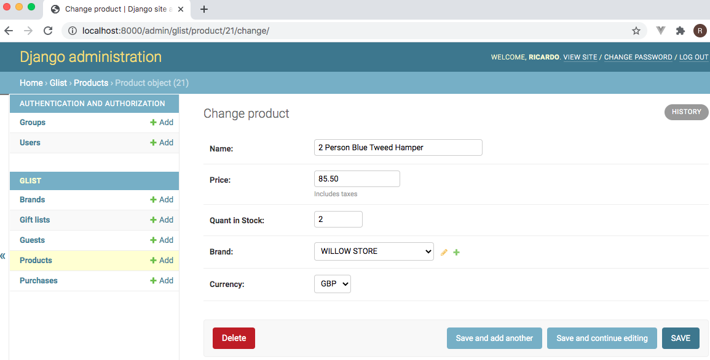
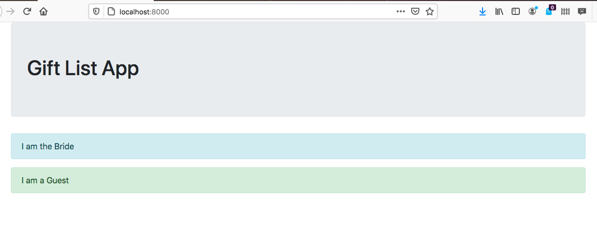
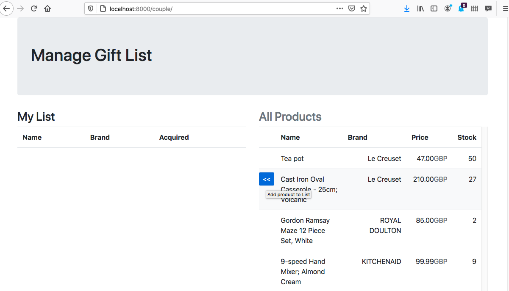

# wedding-list

### Managing wedding lists for couples. 

A couple creates a wedding list and adds different types of products to that which become available to their wedding **guests** for purchase as a present. After the wedding the couple can create their order and decide which gifts to have delivered to them from all the guests’ purchases.

### Models example

### Index

### Manage

