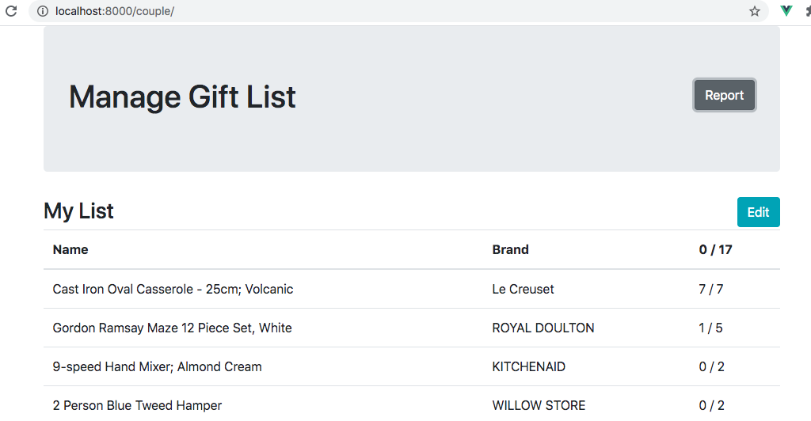
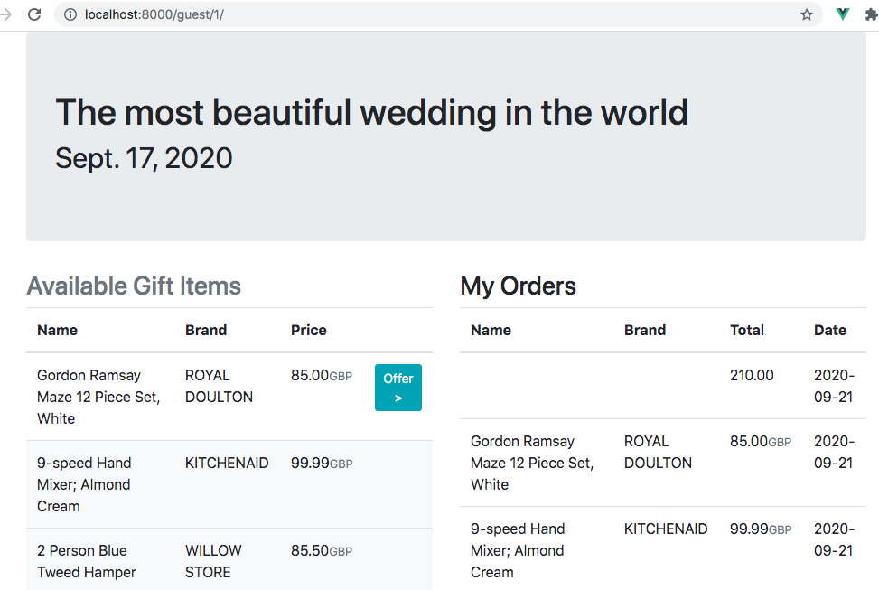
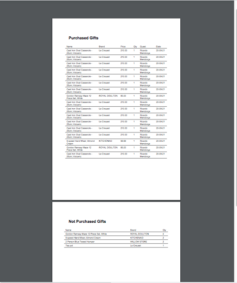

# wedding-list

### Managing wedding lists for couples. 

A couple creates a wedding list and adds different types of products to that which become available to their wedding **guests** for purchase as a present. After the wedding the couple can create their order and decide which gifts to have delivered to them from all the guests’ purchases.

### Setup
 1. Checkout this repo intoa working folder in your *nix filesystem
 
        $ git clone https://github.com/rmendocna/wedding-list.git
        $ cd wedding-list
    
 2. If you use docker just do

        $ docker-compose up
     
 3. Otherwise, you need to replicate the steps described in the dockerfile and start the development server

        $ git clone https://github.com/rmendocna/wedding-list.git
        $ cd wedding-list
        $ python3 -mvenv .
        (wedding-list) $ python manage.py migrate
        (wedding-list) $ DJANGO_SUPERUSER_PASSWORD=test python manage.py createsuperuser --username test --email test@test.tst --noinput
        (wedding-list) $ python manage.py load_products glist/fixtures/products.json
        (wedding-list) $ python manage.py loaddata users
        (wedding-list) $ python manage.py loaddata giftlist
        (wedding-list) $ python manage.py loaddata guests
        (wedding-list) $ python manage.py runserver 
    
 4. You can now browse to 
        
        http://localhost:8000

### Usage
There is a predefined list of products which the Gift List manager will be allowed to choose from.

Two users are made available for this exercise:

 1. a _test/test_ user which will simulate the role of a gift list manager who will be able to add and remove items from the list
 2. a _guest/guest_ user which will simulate a person who purchase items from the list

The 'test' user is a superuser so it can access the Django built-in /admin/ interfaces. A logout page was not made available either one uses a clear browser session to login as a different user or is logged is as test and proceed to logout there.
  
### Models example

### Index

### Manage

#### Manage has a report button now

And the actual product list only shows on demand.
At the beginning all you see is your own Gift List.

### Guest ordering page

### Print
The report comes out in PDF Format

